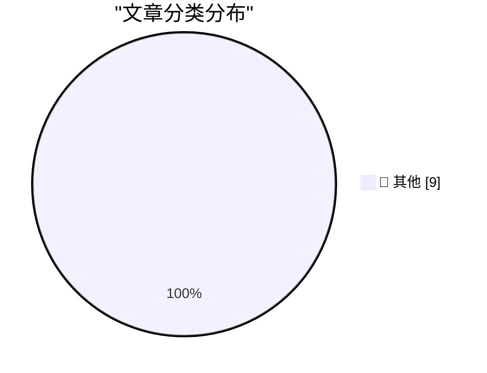

# 📰 AI 博客每日精选 — 2026-02-21

> 来自 Karpathy 推荐的 92 个顶级技术博客，AI 精选 Top 9

## 🏆 今日必读

🥇 **Quoting Thibault Sottiaux**

[Quoting Thibault Sottiaux](https://simonwillison.net/2026/Feb/21/thibault-sottiaux/#atom-everything) — simonwillison.net · 21 小时前 · 📝 其他

> Quoting Thibault Sottiaux

🥈 **Andrej Karpathy talks about "Claws"**

[Andrej Karpathy talks about "Claws"](https://simonwillison.net/2026/Feb/21/claws/#atom-everything) — simonwillison.net · 22 小时前 · 📝 其他

> Andrej Karpathy talks about "Claws"

🥉 **Adding TILs, releases, museums, tools and research to my blog**

[Adding TILs, releases, museums, tools and research to my blog](https://simonwillison.net/2026/Feb/20/beats/#atom-everything) — simonwillison.net · 23 小时前 · 📝 其他

> Adding TILs, releases, museums, tools and research to my blog

---

## 📊 数据概览

| 扫描源 | 抓取文章 | 时间范围 | 精选 |
|:---:|:---:|:---:|:---:|
| 82/92 | 2360 篇 → 9 篇 | 24h | **9 篇** |

### 分类分布

---

## 📝 其他

### 1. Quoting Thibault Sottiaux

[Quoting Thibault Sottiaux](https://simonwillison.net/2026/Feb/21/thibault-sottiaux/#atom-everything) — **simonwillison.net** · 21 小时前 · ⭐ 15/30

> Quoting Thibault Sottiaux

---

### 2. Andrej Karpathy talks about "Claws"

[Andrej Karpathy talks about "Claws"](https://simonwillison.net/2026/Feb/21/claws/#atom-everything) — **simonwillison.net** · 22 小时前 · ⭐ 15/30

> Andrej Karpathy talks about "Claws"

---

### 3. Adding TILs, releases, museums, tools and research to my blog

[Adding TILs, releases, museums, tools and research to my blog](https://simonwillison.net/2026/Feb/20/beats/#atom-everything) — **simonwillison.net** · 23 小时前 · ⭐ 15/30

> Adding TILs, releases, museums, tools and research to my blog

---

### 4. OpenBenches at FOSDEM

[OpenBenches at FOSDEM](https://shkspr.mobi/blog/2026/02/openbenches-at-fosdem/) — **shkspr.mobi** · 10 小时前 · ⭐ 15/30

> OpenBenches at FOSDEM

---

### 5. Computing big, certified Fibonacci numbers

[Computing big, certified Fibonacci numbers](https://www.johndcook.com/blog/2026/02/21/big-certified-fibonacci/) — **johndcook.com** · 4 小时前 · ⭐ 15/30

> Computing big, certified Fibonacci numbers

---

### 6. Wrapping Code Comments

[Wrapping Code Comments](https://matklad.github.io/2026/02/21/wrapping-code-comments.html) — **matklad.github.io** · 23 小时前 · ⭐ 15/30

> Wrapping Code Comments

---

### 7. Track Zelda release anniversaries in your calendar

[Track Zelda release anniversaries in your calendar](https://evanhahn.com/zelda-anniversary-calendar/) — **evanhahn.com** · 23 小时前 · ⭐ 15/30

> Track Zelda release anniversaries in your calendar

---

### 8. Whale Fall

[Whale Fall](https://nesbitt.io/2026/02/21/whale-fall.html) — **nesbitt.io** · 23 小时前 · ⭐ 15/30

> Whale Fall

---

### 9. Reading List 02/21/26

[Reading List 02/21/26](https://www.construction-physics.com/p/reading-list-022126) — **construction-physics.com** · 9 小时前 · ⭐ 15/30

> Reading List 02/21/26

---

*生成于 2026-02-21 23:02 | 扫描 82 源 → 获取 2360 篇 → 精选 9 篇*
*基于 [Hacker News Popularity Contest 2025](https://refactoringenglish.com/tools/hn-popularity/) RSS 源列表，由 [Andrej Karpathy](https://x.com/karpathy) 推荐*
*由「懂点儿AI」制作，欢迎关注同名微信公众号获取更多 AI 实用技巧 💡*
