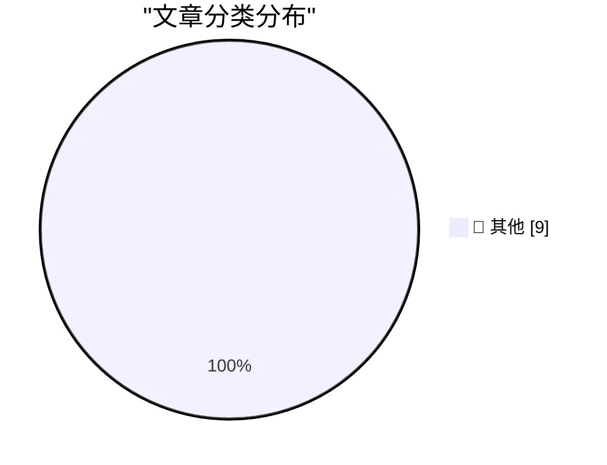

# 📰 AI 博客每日精选 — 2026-02-22

> 来自 Karpathy 推荐的 92 个顶级技术博客，AI 精选 Top 9

## 🏆 今日必读

🥇 **How I think about Codex**

[How I think about Codex](https://simonwillison.net/2026/Feb/22/how-i-think-about-codex/#atom-everything) — simonwillison.net · 7 小时前 · 📝 其他

> 
<strong><a href="https://www.linkedin.com/pulse/how-i-think-codex-gabriel-chua-ukhic">How I think about Codex</a></strong>

Gabriel Chua (Developer Experience Engineer for APAC at OpenAI) provid

🥈 **Sentry**

[Sentry](https://sentry.io/resources/ios-workshop-jan-2026/?utm_source=daringfireball&amp;utm_medium=paid-display&amp;utm_campaign=general-fy27q1-evergreen&amp;utm_content=static-ad-mobilerss-trysentry) — daringfireball.net · 2 小时前 · 📝 其他

> My thanks to Sentry for sponsoring last week at DF. Sentry is running a hands-on workshop: “Crash Reporting, Tracing, and Logs for iOS in Sentry”. You can watch it on demand. You’ll learn how to conne

🥉 **Nvidia was only invited to invest**

[Nvidia was only invited to invest](https://idiallo.com/byte-size/nvidia-was-only-invited-to-invest?src=feed) — idiallo.com · 23 小时前 · 📝 其他

> Nvidia was only invited to invest. 

That is one reversal of commitment. Remember that graph that has been circling around for some time now? The one that shows the circular investment from AI compani

---

## 📊 数据概览

| 扫描源 | 抓取文章 | 时间范围 | 精选 |
|:---:|:---:|:---:|:---:|
| 82/92 | 2360 篇 → 9 篇 | 24h | **9 篇** |

### 分类分布

---

## 📝 其他

### 1. How I think about Codex

[How I think about Codex](https://simonwillison.net/2026/Feb/22/how-i-think-about-codex/#atom-everything) — **simonwillison.net** · 7 小时前 · ⭐ 15/30

> 
<strong><a href="https://www.linkedin.com/pulse/how-i-think-codex-gabriel-chua-ukhic">How I think about Codex</a></strong>

Gabriel Chua (Developer Experience Engineer for APAC at OpenAI) provid

---

### 2. Sentry

[Sentry](https://sentry.io/resources/ios-workshop-jan-2026/?utm_source=daringfireball&amp;utm_medium=paid-display&amp;utm_campaign=general-fy27q1-evergreen&amp;utm_content=static-ad-mobilerss-trysentry) — **daringfireball.net** · 2 小时前 · ⭐ 15/30

> My thanks to Sentry for sponsoring last week at DF. Sentry is running a hands-on workshop: “Crash Reporting, Tracing, and Logs for iOS in Sentry”. You can watch it on demand. You’ll learn how to conne

---

### 3. Nvidia was only invited to invest

[Nvidia was only invited to invest](https://idiallo.com/byte-size/nvidia-was-only-invited-to-invest?src=feed) — **idiallo.com** · 23 小时前 · ⭐ 15/30

> Nvidia was only invited to invest. 

That is one reversal of commitment. Remember that graph that has been circling around for some time now? The one that shows the circular investment from AI compani

---

### 4. How close are we to a vision for 2010?

[How close are we to a vision for 2010?](https://shkspr.mobi/blog/2026/02/how-close-are-we-to-a-vision-for-2010/) — **shkspr.mobi** · 10 小时前 · ⭐ 15/30

> Twenty five years ago today, the EU's IST advisory group published a paper about the future of "Ambient Intelligence". Way before the world got distracted with cryptoscams and AI slop, we genuinely th

---

### 5. Bitcoin mining difficulty

[Bitcoin mining difficulty](https://www.johndcook.com/blog/2026/02/22/bitcoin-mining-difficulty/) — **johndcook.com** · 3 小时前 · ⭐ 15/30

> The previous post looked at the Bitcoin network hash rate, currently around one zettahash per second, i.e. 1021 hashes per second. The difficulty of mining a Bitcoin block adjusts over time to keep th

---

### 6. Exahash, Zettahash, Yottahash

[Exahash, Zettahash, Yottahash](https://www.johndcook.com/blog/2026/02/22/zettahash/) — **johndcook.com** · 4 小时前 · ⭐ 15/30

> When I first heard of cryptographic hash functions, they were called “one-way functions” and seemed like a mild curiosity. I had no idea that one day the world would compute a mind-boggling number of 

---

### 7. 10,000,000th Fibonacci number

[10,000,000th Fibonacci number](https://www.johndcook.com/blog/2026/02/21/f10000000/) — **johndcook.com** · 22 小时前 · ⭐ 15/30

> I’ve written a couple times about Fibonacci numbers and certificates. Here the certificate is auxiliary data that makes it faster to confirm that the original calculation was correct. This post puts s

---

### 8. Forge-Specific Repository Folders

[Forge-Specific Repository Folders](https://nesbitt.io/2026/02/22/forge-specific-repository-folders.html) — **nesbitt.io** · 13 小时前 · ⭐ 15/30

> Magic folders in git forges: what .github/, .gitlab/, .gitea/, .forgejo/ and .bitbucket/ do.

---

### 9. Nerd Quiz #4

[Nerd Quiz #4](https://susam.net/code/news/nq/4.0.0.html) — **susam.net** · 23 小时前 · ⭐ 15/30

> Nerd Quiz #4 is the fourth instalment of Nerd Quiz, a single page
  HTML application that challenges you to measure your inner geek with
  a brief quiz.  Each question in the quiz comes from everyday 

---

*生成于 2026-02-22 23:03 | 扫描 82 源 → 获取 2360 篇 → 精选 9 篇*
*基于 [Hacker News Popularity Contest 2025](https://refactoringenglish.com/tools/hn-popularity/) RSS 源列表，由 [Andrej Karpathy](https://x.com/karpathy) 推荐*
