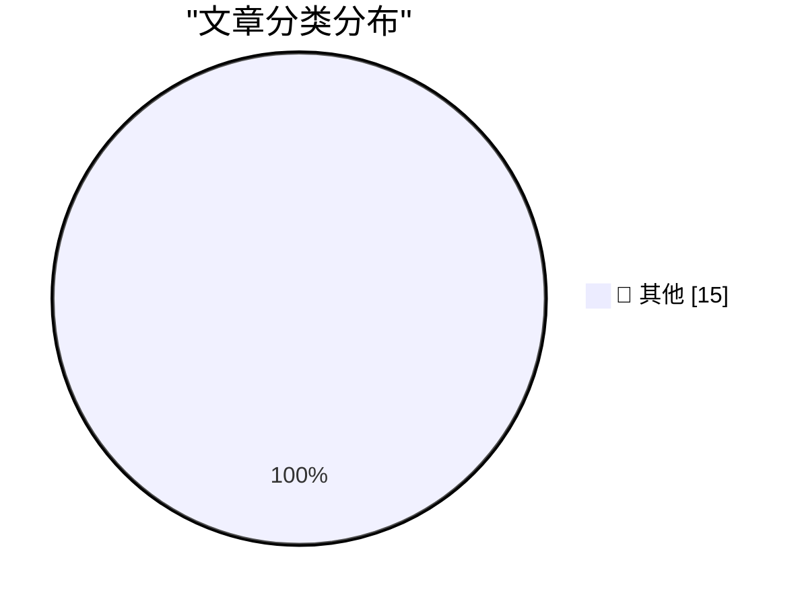

# 📰 AI 博客每日精选 — 2026-02-23

> 来自 Karpathy 推荐的 92 个顶级技术博客，AI 精选 Top 15

## 🏆 今日必读

🥇 **Ladybird adopts Rust, with help from AI**

[Ladybird adopts Rust, with help from AI](https://simonwillison.net/2026/Feb/23/ladybird-adopts-rust/#atom-everything) — simonwillison.net · 4 小时前 · 📝 其他

> 
<strong><a href="https://ladybird.org/posts/adopting-rust/">Ladybird adopts Rust, with help from AI</a></strong>

Really interesting case-study from Andreas Kling on advanced, sophisticated use 

🥈 **Writing about Agentic Engineering Patterns**

[Writing about Agentic Engineering Patterns](https://simonwillison.net/2026/Feb/23/agentic-engineering-patterns/#atom-everything) — simonwillison.net · 5 小时前 · 📝 其他

> 
I've started a new project to collect and document <strong><a href="https://simonwillison.net/guides/agentic-engineering-patterns/">Agentic Engineering Patterns</a></strong> - coding practices and 

🥉 **Writing code is cheap now**

[Writing code is cheap now](https://simonwillison.net/guides/agentic-engineering-patterns/code-is-cheap/#atom-everything) — simonwillison.net · 6 小时前 · 📝 其他

> 
<em><a href="https://simonwillison.net/guides/agentic-engineering-patterns/">Agentic Engineering Patterns</a> ></em>

    
The biggest challenge in adopting agentic engineering practices is ge

---

## 📊 数据概览

| 扫描源 | 抓取文章 | 时间范围 | 精选 |
|:---:|:---:|:---:|:---:|
| 82/92 | 2361 篇 → 29 篇 | 24h | **15 篇** |

### 分类分布

---

## 📝 其他

### 1. Ladybird adopts Rust, with help from AI

[Ladybird adopts Rust, with help from AI](https://simonwillison.net/2026/Feb/23/ladybird-adopts-rust/#atom-everything) — **simonwillison.net** · 4 小时前 · ⭐ 15/30

> 
<strong><a href="https://ladybird.org/posts/adopting-rust/">Ladybird adopts Rust, with help from AI</a></strong>

Really interesting case-study from Andreas Kling on advanced, sophisticated use 

---

### 2. Writing about Agentic Engineering Patterns

[Writing about Agentic Engineering Patterns](https://simonwillison.net/2026/Feb/23/agentic-engineering-patterns/#atom-everything) — **simonwillison.net** · 5 小时前 · ⭐ 15/30

> 
I've started a new project to collect and document <strong><a href="https://simonwillison.net/guides/agentic-engineering-patterns/">Agentic Engineering Patterns</a></strong> - coding practices and 

---

### 3. Writing code is cheap now

[Writing code is cheap now](https://simonwillison.net/guides/agentic-engineering-patterns/code-is-cheap/#atom-everything) — **simonwillison.net** · 6 小时前 · ⭐ 15/30

> 
<em><a href="https://simonwillison.net/guides/agentic-engineering-patterns/">Agentic Engineering Patterns</a> ></em>

    
The biggest challenge in adopting agentic engineering practices is ge

---

### 4. Quoting Paul Ford

[Quoting Paul Ford](https://simonwillison.net/2026/Feb/23/paul-ford/#atom-everything) — **simonwillison.net** · 7 小时前 · ⭐ 15/30

> <blockquote cite="https://ftrain.com/leading-thoughts">
The paper asked me to explain vibe coding, and I did so, because I think something big is coming there, and I'm deep in, and I worry that norm

---

### 5. Reply guy

[Reply guy](https://simonwillison.net/2026/Feb/23/reply-guy/#atom-everything) — **simonwillison.net** · 9 小时前 · ⭐ 15/30

> 
The latest scourge of Twitter is AI bots that reply to your tweets with generic, banal commentary slop, often accompanied by a question to "drive engagement" and waste as much of your time as possi

---

### 6. Quoting Summer Yue

[Quoting Summer Yue](https://simonwillison.net/2026/Feb/23/summer-yue/#atom-everything) — **simonwillison.net** · 10 小时前 · ⭐ 15/30

> <blockquote cite="https://twitter.com/summeryue0/status/2025836517831405980">
Nothing humbles you like telling your OpenClaw “confirm before acting” and watching it speedrun deleting your inbox. I c

---

### 7. Red/green TDD

[Red/green TDD](https://simonwillison.net/guides/agentic-engineering-patterns/red-green-tdd/#atom-everything) — **simonwillison.net** · 15 小时前 · ⭐ 15/30

> 
<em><a href="https://simonwillison.net/guides/agentic-engineering-patterns/">Agentic Engineering Patterns</a> ></em>

    
"<strong>Use red/green TDD</strong>" is a pleasingly succinct way to 

---

### 8. The Claude C Compiler: What It Reveals About the Future of Software

[The Claude C Compiler: What It Reveals About the Future of Software](https://simonwillison.net/2026/Feb/22/ccc/#atom-everything) — **simonwillison.net** · 23 小时前 · ⭐ 15/30

> 
<strong><a href="https://www.modular.com/blog/the-claude-c-compiler-what-it-reveals-about-the-future-of-software">The Claude C Compiler: What It Reveals About the Future of Software</a></strong>
 
<strong><a href="https://www.londonstockexchange.com/stock/RPI/raspberry-pi-holdings-plc/company-page">London Stock Exchange: Raspberry Pi Holdings plc</a></strong>

Striking graph illustrating 

---

### 10. Insider amnesia

[Insider amnesia](https://seangoedecke.com/insider-amnesia/) — **seangoedecke.com** · 23 小时前 · ⭐ 15/30

> 
Speculation about what’s really going on inside a tech company is almost always wrong. 

When some problem with your company is posted on the internet, and you read people’s thoughts on it, t

---

### 11. What's so hard about continuous learning?

[What's so hard about continuous learning?](https://seangoedecke.com/continuous-learning/) — **seangoedecke.com** · 23 小时前 · ⭐ 15/30

> 
Why can’t models continue to get smarter after they’re deployed? If you hire a human employee, they will grow more familiar with your systems over time, and (if they stick around long enough) event

---

### 12. NetNewsWire 7 for Mac

[NetNewsWire 7 for Mac](https://netnewswire.blog/2026/01/27/netnewswire-for-mac.html) — **daringfireball.net** · 1 小时前 · ⭐ 15/30

> Brent Simmons, last month:

  The big change from 6.2.1 is that it adopts the Liquid Glass UI
and it requires macOS 26.

(Note to people who aren’t on macOS 26: we fixed a lot of bugs in
6.2 and 6.2.

---

### 13. Trader Joe’s Dark Chocolate Peanut Butter Cups

[Trader Joe’s Dark Chocolate Peanut Butter Cups](https://www.traderjoes.com/home/products/pdp/dark-chocolate-peanut-butter-cups-094064) — **daringfireball.net** · 1 小时前 · ⭐ 15/30

> Trader Joe’s:

  Like their milk chocolate brethren on our shelves, our Dark
Chocolate Peanut Butter Cups are made with real peanut butter
that’s made with slowly roasted and ground Virginia peanuts.

---

### 14. Grandson of Inventor of Reese’s Peanut Butter Cups Goes Public With the Obvious: They Taste Like Shit Now

[Grandson of Inventor of Reese’s Peanut Butter Cups Goes Public With the Obvious: They Taste Like Shit Now](https://apnews.com/article/reeses-peanut-butter-cups-hershey-chocolate-1a66ec75247fd146888b7a747a740cd3) — **daringfireball.net** · 1 小时前 · ⭐ 15/30

> Brad Reese, on LinkedIn last week:

  My grandfather, H. B. Reese (Who Invented Reese’s), built Reese’s
on a simple, enduring architecture: Milk Chocolate + Peanut
Butter. Not a flavor idea. Not a ma

---

### 15. The Little Red Dot

[The Little Red Dot](https://idiallo.com/blog/little-red-dot?src=feed) — **idiallo.com** · 11 小时前 · ⭐ 15/30

> Sometimes, I have 50 tabs open. Looking for a single piece of information ends up being a rapid click on each tab until I find what I'm looking for. Somehow, every time I get to that LinkedIn tab, I p

---

*生成于 2026-02-23 23:02 | 扫描 82 源 → 获取 2361 篇 → 精选 15 篇*
*基于 [Hacker News Popularity Contest 2025](https://refactoringenglish.com/tools/hn-popularity/) RSS 源列表，由 [Andrej Karpathy](https://x.com/karpathy) 推荐*
