# 📰 AI 博客每日精选 — 2026-02-25

> 来自 Karpathy 推荐的 92 个顶级技术博客，AI 精选 Top 15

## 🏆 今日必读

🥇 **tldraw issue: Move tests to closed source repo**

[tldraw issue: Move tests to closed source repo](https://simonwillison.net/2026/Feb/25/closed-tests/#atom-everything) — simonwillison.net · 1 小时前 · 📝 其他

> 
<strong><a href="https://github.com/tldraw/tldraw/issues/8082">tldraw issue: Move tests to closed source repo</a></strong>

It's become very apparent over the past few months that a comprehensiv

🥈 **Claude Code Remote Control**

[Claude Code Remote Control](https://simonwillison.net/2026/Feb/25/claude-code-remote-control/#atom-everything) — simonwillison.net · 5 小时前 · 📝 其他

> 
<strong><a href="https://code.claude.com/docs/en/remote-control">Claude Code Remote Control</a></strong>

New Claude Code feature dropped yesterday: you can now run a "remote control" session on

🥉 **I vibe coded my dream macOS presentation app**

[I vibe coded my dream macOS presentation app](https://simonwillison.net/2026/Feb/25/present/#atom-everything) — simonwillison.net · 6 小时前 · 📝 其他

> 
I gave a talk this weekend at Social Science FOO Camp in Mountain View. The event was a classic unconference format where anyone could present a talk without needing to propose it in advance. I gra

---

## 📊 数据概览

| 扫描源 | 抓取文章 | 时间范围 | 精选 |
|:---:|:---:|:---:|:---:|
| 82/92 | 2361 篇 → 24 篇 | 24h | **15 篇** |

### 分类分布

```mermaid
pie showData
    title "文章分类分布"
    "📝 其他" : 15
```

---

## 📝 其他

### 1. tldraw issue: Move tests to closed source repo

[tldraw issue: Move tests to closed source repo](https://simonwillison.net/2026/Feb/25/closed-tests/#atom-everything) — **simonwillison.net** · 1 小时前 · ⭐ 15/30

> 
<strong><a href="https://github.com/tldraw/tldraw/issues/8082">tldraw issue: Move tests to closed source repo</a></strong>

It's become very apparent over the past few months that a comprehensiv

---

### 2. Claude Code Remote Control

[Claude Code Remote Control](https://simonwillison.net/2026/Feb/25/claude-code-remote-control/#atom-everything) — **simonwillison.net** · 5 小时前 · ⭐ 15/30

> 
<strong><a href="https://code.claude.com/docs/en/remote-control">Claude Code Remote Control</a></strong>

New Claude Code feature dropped yesterday: you can now run a "remote control" session on

---

### 3. I vibe coded my dream macOS presentation app

[I vibe coded my dream macOS presentation app](https://simonwillison.net/2026/Feb/25/present/#atom-everything) — **simonwillison.net** · 6 小时前 · ⭐ 15/30

> 
I gave a talk this weekend at Social Science FOO Camp in Mountain View. The event was a classic unconference format where anyone could present a talk without needing to propose it in advance. I gra

---

### 4. Quoting Kellan Elliott-McCrea

[Quoting Kellan Elliott-McCrea](https://simonwillison.net/2026/Feb/25/kellan-elliott-mccrea/#atom-everything) — **simonwillison.net** · 19 小时前 · ⭐ 15/30

> <blockquote cite="https://laughingmeme.org/2026/02/09/code-has-always-been-the-easy-part.html">
It’s also reasonable for people who entered technology in the last couple of decades because it was go

---

### 5. Linear walkthroughs

[Linear walkthroughs](https://simonwillison.net/guides/agentic-engineering-patterns/linear-walkthroughs/#atom-everything) — **simonwillison.net** · 21 小时前 · ⭐ 15/30

> 
<em><a href="https://simonwillison.net/guides/agentic-engineering-patterns/">Agentic Engineering Patterns</a> ></em>

    
Sometimes it's useful to have a coding agent give you a structured wa

---

### 6. Greg Knauss: ‘Lose Myself’

[Greg Knauss: ‘Lose Myself’](https://www.eod.com/blog/2026/02/lose-myself/) — **daringfireball.net** · 12 分钟前 · ⭐ 15/30

> Greg Knauss:

  People will argue that speaking English to LLMs is just another
level of abstraction away from the physics of how the machine
actually works. And while that’s technically true — the w

---

### 7. The Talk Show: ‘Serious Opinionators’

[The Talk Show: ‘Serious Opinionators’](https://daringfireball.net/thetalkshow/2026/02/25/ep-441) — **daringfireball.net** · 47 分钟前 · ⭐ 15/30

> Adam Engst returns to the show to talk, in detail, about certain of the UI changes in iOS 26 and Apple’s version 26 OSes overall. In particular, the new Unified view in the Phone app, and the Filter p

---

### 8. Samsung Galaxy S26 Ultra’s Privacy Display

[Samsung Galaxy S26 Ultra’s Privacy Display](https://9to5google.com/2026/02/25/samsung-galaxy-s26-ultra-privacy-display-demo-hands-on/) — **daringfireball.net** · 2 小时前 · ⭐ 15/30

> Ben Schoon, writing for 9to5 Google:

  When activated, Privacy Display changes how the pixels in your
display emit light, making it harder or near-impossible to view
the display at an off-angle. At 

---

### 9. ★ My 2025 Apple Report Card

[★ My 2025 Apple Report Card](https://daringfireball.net/2026/02/my_2025_apple_report_card) — **daringfireball.net** · 6 小时前 · ⭐ 15/30

> A mixed year.

---

### 10. Major Candy Brands Are Switching From Actual Chocolate to ‘Chocolately Candy’ (Read: Brown Candle Wax)

[Major Candy Brands Are Switching From Actual Chocolate to ‘Chocolately Candy’ (Read: Brown Candle Wax)](https://www.jezebel.com/fake-milk-chocolate-replacements-brands-reeses-hershey-ferrero-compound-coating-candy-climate-change) — **daringfireball.net** · 7 小时前 · ⭐ 15/30

> Jim Vorel, writing just yesterday for Jezebel:

  It can be hard to know what exactly to call the substances that
are now found coating many major candy bars such as Butterfinger,
Baby Ruth, Almond J

---

### 11. I Am Nothing if Not a Man of Science

[I Am Nothing if Not a Man of Science](https://mastodon.social/@gruber/116131665730352697) — **daringfireball.net** · 8 小时前 · ⭐ 15/30

> After writing a few days ago about the current brouhaha over the severe decline in the edibility of Reese’s Peanut Butter Cups, and linking to Trader Joe’s shade-throwing description of their own, I o

---

### 12. [Sponsor] Hands-On Workshop: Fix It Faster — Crash Reporting, Tracing, and Logs for iOS in Sentry

[[Sponsor] Hands-On Workshop: Fix It Faster — Crash Reporting, Tracing, and Logs for iOS in Sentry](https://sentry.io/resources/ios-workshop-jan-2026/?utm_source=daringfireball&amp;utm_medium=paid-display&amp;utm_campaign=general-fy27q1-evergreen&amp;utm_content=static-ad-mobilerss-trysentry) — **daringfireball.net** · 22 小时前 · ⭐ 15/30

> Learn how to connect the dots between slowdowns, crashes, and the user experience in your iOS app. This on-demand session covers how to:

Set up Sentry to surface high-priority mobile issues without 

---

### 13. Upgrade: ‘The Shifting Sands of Liquid Glass’

[Upgrade: ‘The Shifting Sands of Liquid Glass’](https://www.relay.fm/upgrade/604) — **daringfireball.net** · 23 小时前 · ⭐ 15/30

> Jason Snell and Myke Hurley:

  We discuss the results of the Six Colors Apple Report Card for
2025 in depth, with our added opinions on every category. Jason
chooses to be a rascal, and Myke tries t

---

### 14. When access to knowledge is no longer the limitation

[When access to knowledge is no longer the limitation](https://idiallo.com/blog/access-to-knowledge-is-no-longer-a-limitation?src=feed) — **idiallo.com** · 11 小时前 · ⭐ 15/30

> Let's do this thought experiment together. I have a little box. I'll place the box on the table. Now I'll open the little box and put all the arguments against large language models in it. I'll put al

---

### 15. Pluralistic: The whole economy pays the Amazon tax (25 Feb 2026)

[Pluralistic: The whole economy pays the Amazon tax (25 Feb 2026)](https://pluralistic.net/2026/02/25/most-favored-nation/) — **pluralistic.net** · 11 小时前 · ⭐ 15/30

> Today's links The whole economy pays the Amazon tax: You can't shop your way out of a monopoly. Hey look at this: Delights to delectate. Object permanence: Math denial; Disney v young Tim Burton; Make

---

*生成于 2026-02-25 23:05 | 扫描 82 源 → 获取 2361 篇 → 精选 15 篇*
*基于 [Hacker News Popularity Contest 2025](https://refactoringenglish.com/tools/hn-popularity/) RSS 源列表，由 [Andrej Karpathy](https://x.com/karpathy) 推荐*
